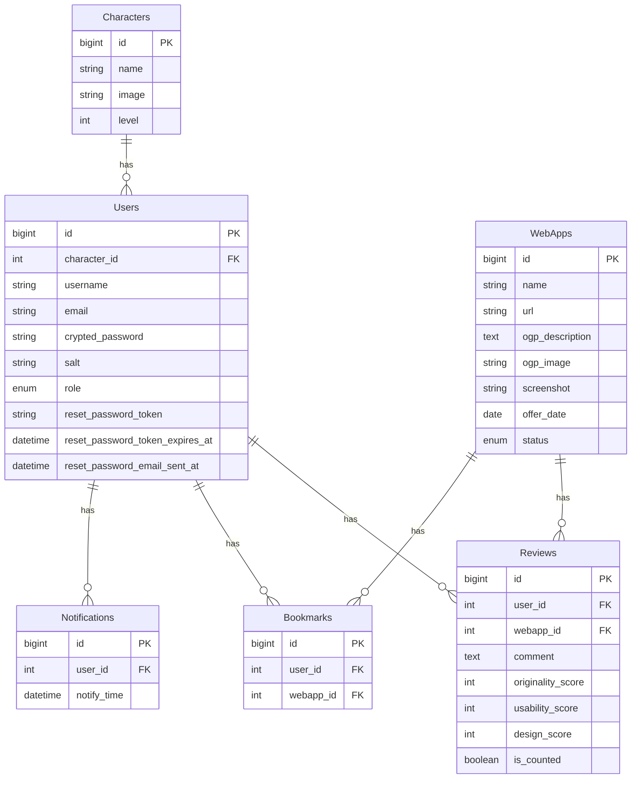

# WebAppDiary

### ■サービス概要
個人開発の参考としてUI/UXの情報収集を継続的に行いたい人のための、
1日1Webアプリ提供＆記録サービスです。

### ■ユーザーが抱える課題
個人開発等の参考としてUI/UXの情報収集を行うために、世の中のWebアプリ・サービスを継続的に体験し、記録を残したいが続かない。

### ■課題に対する仮説
（独自で実施したアンケート調査結果より）
- Webアプリ・サービスの数が膨大であり、体験するWebアプリ・サービスを決めるのに時間がかかってしまうことで、結果探すこと自体面倒だと感じてしまう。
- 記録用フォーマットを作成するのが面倒だと感じてしまう。
- コード実装等のプログラミング学習を優先してしまい、Webアプリ・サービスを体験することを忘れてしまう。

### ■解決方法
- 毎日１つのWebアプリ・サービスを提供し、いくつか評価項目を用意して5段階評価で記録を取れるアプリを作成する。
- ユーザーが任意で通知タイミングを設定することで、記録忘れの防止。

### ■メインのターゲットユーザー
個人開発を行う予定があるプログラミング初学者

### ■実装予定の機能(MVP)
- Webアプリ・サービスを1日1つ提供
    - 「今日のサービス」ページにて、毎日0:00にWebアプリ・サービスが自動的に更新される

- 全ユーザー
	- ユーザー登録
		- topページから「ユーザー登録」ページに遷移できる
	- 提供されるWebアプリ・サービスの閲覧
		- topページから「今日のサービス」ページに遷移できる
		- 「今日のサービス」ページから提供されたWebアプリ・サービスのリンクに遷移できる
		- 「#1日1サービス」というタグでのTwitterシェア

- ログインユーザー
	- ログイン・ログアウト機能
		- topページから「ログイン」ページに遷移できる
		- メニューバーからログアウトすることができる
	- 提供されたWebアプリ・サービスの評価
		- 「評価を記録する」ボタンの設置し、モーダルにて評価画面を表示する
		- 「オリジナリティ・ユーザビリティ・デザイン」の項目を５段階で評価できる（ラジオボタン）
		- 任意でコメントを登録することができる
	- マイページにて評価記録の確認
		- マイページ画面へ遷移することができる
		- 評価記録の一覧、編集
　
- 管理ユーザー
	- 提供するWebアプリ・サービスの一覧、詳細、作成、編集、削除
	- 記録結果の一覧、詳細、作成、編集、削除
	- ユーザーの一覧、詳細、作成、編集、削除

### ■実装予定の機能(本番リリース)
- ログインユーザー
	- ブックマーク機能
		- 「ブックマーク」ボタンの設置
		- マイページから「ブックマーク」ページに遷移できる
	- 記録日数ランキング機能
		- 記録をとることによって日数がカウントされる
		- マイページに記録した日数の表示
		- 「記録日数ランキング」ページに遷移できる
	- 過去に提供されたWebアプリ・サービスの閲覧
		- 「今まで提供されたサービス」ページに遷移できる
		- 過去に提供されたWebアプリ・サービスを評価することができる
			- 評価記録した日数としてはカウントされない
	- 通知機能
		- 「通知設定」ボタンを設置して、モーダルにて設定画面を表示する
		- ユーザーが任意の時間を設定し、「今日のWebアプリ・サービスを体験しましょう！」と通知する
	- 育成ゲーム要素の追加
		- キャラクターを設置し、記録を取るほど成長する
			- 現時点案では、10日記録するごとにキャラクターが進化する
		- ユーザーアバターをキャラクターにする

### ■補足
- Webアプリ・サービスのデータ取集は、まずはRUNTEQ求人サイトに掲載されている企業のサービスを手動で行う。その後、いくつかのサイトからスクレイピングにてデータ収集予定。（サイトは随時見つけていく）　
→結果的にスクレイピングが厳しそうであれば、全て手動でデータ収集する。

### ■なぜこのサービスを作りたいのか？
プログラミング学習を開始した当初、個人開発Webアプリの作成に向けて、「必ず1日1サービス体験し、UI/UXなどWebアプリの機能について自身の引き出しを誰よりも増やそう」と決意したが、そもそも世の中にあるWebアプリ・サービスが多すぎて、どれを体験するか決めるのに時間がかかってしまい、その結果面倒だと感じていた。頭の中では「やらなきゃ」とわかっていても、気がつけば全く続かなかっため、「1日1つでいいから、自動的にWebアプリ・サービスを提供してくれるサービスがあると便利だな」と感じていた。

### ■使用技術
- Heroku
- Rails7
- PostgreSQL
- Tailwind CSS
- Docker
- LINE Messaging API
- Twitter API
- screenshotlayer API

### ■画面遷移図
https://www.figma.com/file/Vi640C6qKpIrX11KXXAEXu/WebAppDiary?type=design&t=DboXEke8o2cQxFRE-6

### ■ER図

### ■スケジュール
1. 企画（アイデア企画・技術調査）：6/25〆切 　
2. 設計（README作成・画面遷移図作成・ER図作成）：6/30 〆切
3. 機能実装：7/1 - 7/30
4. MVPリリース：8/4〆切
5. 本リリース：8/20
