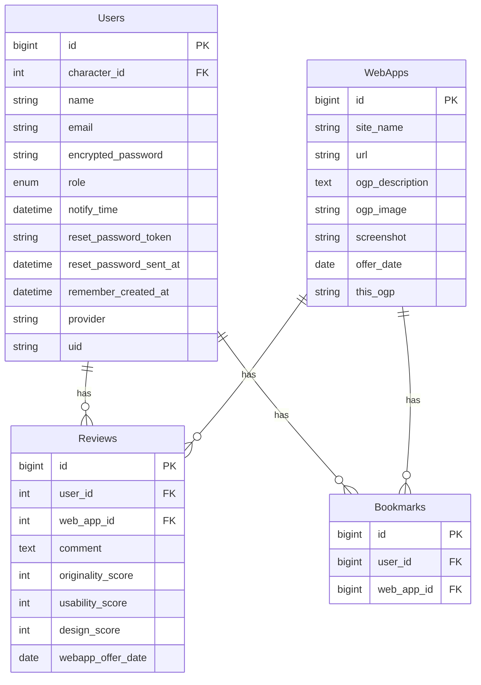

# WebAppDiary

## 【アプリのURL】
### [WebAppDiary](https://www.webappdiary.com/)

## 【WebAppDiaryについて】
### ■サービス概要
個人開発の参考として、デザイン・機能・導線などUI/UXの情報収集を継続的に行いたい人のための、 1日1Webアプリ提供＆記録サービスです。日めくりカレンダーのような形式で、1日に1つのWebアプリを紹介していきます。

### ■メインターゲットユーザー
個人開発を行う予定があるプログラミング初学者
- **【ユーザーが抱える課題】** ~ 個人開発等の参考としてUI/UXの情報収集を行うために、世の中のWebアプリを継続的に体験して記録を残したいが、「Webアプリが多すぎて探すのが面倒」「単純に忘れる」等の理由から続かない。
- **【解決方法】** ~ 毎日１つのWebアプリを提供し、「ユーザビリティ」「オリジナリティ」「デザイン」について5段階評価で記録を取れる。また、ユーザーが任意で通知タイミングを設定することで、記録忘れを防止する。

### ■このアプリを開発するに至った経緯
プログラミング学習を開始した当初、個人開発Webアプリの作成に向けて、「毎日必ず1つのアプリを体験し、UI/UXなどWebアプリの機能について自身の引き出しを誰よりも増やそう」と決意しましたが、そもそも世の中にあるWebアプリが多すぎて、どれを体験するか決めるのに時間がかかってしまい、その結果面倒だと感じてしまいました。
頭の中では「やらなければ」とわかっていても、気がつけば全く続かなかっため、毎日1つのWebアプリを自動的に提供してくれて、その体験を記録できるサービスとして「WebAppDiary」を開発しました。

### ■WebAppDiaryできること
- 1日に1つのWebアプリが提供される。
- 提供されたWebアプリについて、記録を取ることができる。
- いつ何のWebアプリを記録したか、カレンダーで確認することができる。
- 体験したWebアプリをX（Twitter）に共有することができる。
- 1時間単位の任意のタイミングで、LINE通知を受けとることができる。

### ■機能一覧
- 新規ユーザー登録機能
- ユーザーログイン機能（LINEログイン・ゲストログイン可能）
- ユーザーパスワードリセット機能（LINEログイン・ゲストログインユーザーはできません）
- プロフィール編集機能（LINEログイン・ゲストログインユーザーはできません）
- Webアプリの記録登録、編集機能
- LINE通知機能
- 動的OGP表示機能

### ■主な使用技術
### **バックエンド**
- Ruby on Rails (7.0.6)
- Ruby (3.2.0)
- PostgreSQL
- gem
  - devise
  - omniauth-line
  - carrierwave
  - kaminari
  - simple_calendar
  - mini_magick
- API
  - LINE Messaging API
  - screenshotlayer API
### **フロントエンド**
- Tailwind CSS
- Hotwire
### **インフラ**
- Heroku
- Amazon S3

### ■ER図

### 今後の展望
- フロントエンドにJavaScriptの追加
- 当サービス内でのWebアプリ検索機能（オートコンプリート機能）
